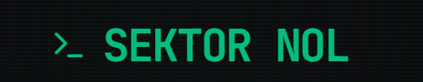

# Sektor Nol

Sektor Nol adalah game simulasi bertahan hidup berbasis teks (Text-Based Survival) dengan antarmuka sci-fi terminal CRT. Game ini memanfaatkan AI generatif untuk merespons tindakan pemain dan menciptakan cerita bertahan hidup yang imersif dan dinamis.



## Fitur Utama & Teknologi

Proyek ini dibangun untuk kompetisi #JuaraVibeCoding dan mendemonstrasikan integrasi modern antara UI reaktif dan Kecerdasan Buatan.

### Fitur Utama

- **AI Dungeon Master**: Respons narasi dinamis menggunakan AI generatif.
- **State Management Terpusat**: AI membaca status pemain dan mengembalikan format JSON untuk mengatur darah, kehangatan, dan inventaris.
- **Efek Visual Reaktif**: Animasi antarmuka CRT dan efek cuaca ekstrem yang merespons secara langsung terhadap kondisi karakter.
- **Keamanan Isolasi Data**: Sistem Autentikasi dan perlindungan rules database yang menjamin keamanan _save data_ tiap pemain.

### Teknologi

- **Google Gemini AI Engine** (gemini-2.5-flash)
- **React 19 & Vite**
- **Tailwind CSS 4.0**
- **Motion (Framer Motion)**
- **Firebase Authentication & Firestore**

## Versi Saat Ini

**v0.9.0 - Cerita Belum Sepenuhnya Selesai**
Saat ini inti dari _game loop_, _state management_, perhitungan cuaca ekstrem, dan integrasi AI telah stabil. Narasi yang lebih dalam untuk akhir cerita (Win Condition) sedang dalam tahap pengembangan.

---

## Panduan Instalasi Lokal

### 1. Persiapan Kebutuhan

- Pastikan **Node.js** (versi 18+) sudah terinstall.
- Dapatkan **Gemini API Key** gratis dari [Google AI Studio](https://aistudio.google.com/).

### 2. Kloning & Instalasi

1. Buka terminal dan arahkan ke folder yang kamu inginkan.
2. Clone repository ini (jika dari Github) atau ekstrak file zip-nya.
3. Jalankan perintah instalasi dependensi:
   ```bash
   npm install
   ```

### 3. Konfigurasi Environment (API Key)

1. Buat file baru bernama `.env.local` di _root folder_ (sejajar dengan `package.json`).
2. Masukkan API Key kamu ke dalam file tersebut:
   ```env
   VITE_GEMINI_API_KEY=AIzaSyBxxxxxxx_xxxxxxx
   ```
   _(Penting: File ini sudah diabaikan oleh `.gitignore` sehingga tidak akan bocor saat di-push ke Github)._

### 4. Menjalankan Game

1. Jalankan server pengembangan lokal:
   ```bash
   npm run dev
   ```
2. Buka browser dan arahkan ke URL yang muncul di terminal (biasanya `http://localhost:5173`).
